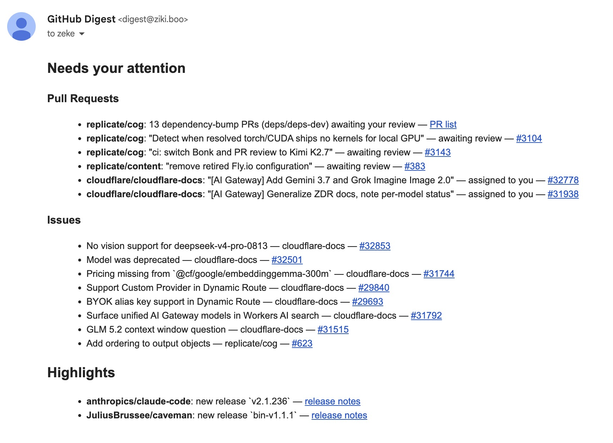

# GitHub Digest


This is a simple automation that emails me a daily summary of GitHub activity
for repos I'm watching.

It uses the [Flue](https://flueframework.com) framework, [Cloudflare AI
Gateway](https://developers.cloudflare.com/ai-gateway/), [Cloudflare Email
Service](https://developers.cloudflare.com/email-routing/), GitHub Actions,
and the GitHub API.

## Example

Here's an example screenshot of the email output:



## How it works

1. **[GitHub Actions](https://docs.github.com/en/actions)** runs the
   automation on a schedule, or on demand. There's no server or Worker
   sitting around waiting for a request; each run is a short-lived process
   on an Actions runner that starts up, does its work, and exits.
2. That process starts a [Flue](https://flueframework.com) **agent** and
   asks it to produce today's digest.
3. The agent calls a **[tool](https://flueframework.com/docs/guide/tools/)**
   that talks to the [GitHub API](https://docs.github.com/en/rest) to fetch
   unread notifications, pull requests, assigned issues, and starred-repo
   activity, and shapes it into one structured summary.
4. A model, called through **[Cloudflare AI
   Gateway](https://developers.cloudflare.com/ai-gateway/)** with Unified
   Billing, reads that summary and writes the digest as Markdown. All it
   needs is a Cloudflare account.
5. The Markdown is converted to HTML and sent as an email via the
   **[Cloudflare Email Sending](https://developers.cloudflare.com/email-routing/)**
   API.

See [AGENTS.md](./AGENTS.md#layout) for the file-by-file breakdown.

## Build your own

Copy and paste this into your favorite agent harness like Claude Code, Codex,
OpenCode, or Pi:

```
Let's build our own Flue automation!

Use this repo for reference: https://github.com/zeke/github-digest
```

## License

MIT
